# Monitor your cronjobs with Zabbix and a wrapper script

This repository contains a python3 wrapper script that allows you to monitor your cron jobs with Zabbix.

In this document:

- [What is it?](#what-is-it)
- [How does it work with Zabbix?](#how-does-it-work-with-zabbix)
- [Setup instructions](#setup-instructions)
- [Syntax reference](#syntax-reference)
  - [Wrapper script syntax](#wrapper-script-syntax)
  - [Details of available invocation parameters](#details-of-available-invocation-parameters)
  - [Available data in the output json files](#available-data-in-the-output-json-files)
- [Additional info](#additional-info)
  - [Want to handle timing out of a cronjob?](#want-to-handle-timing-out-of-a-cronjob)
  - [Want to redirect the stdout of the wrapper script to a file?](#want-to-redirect-the-stdout-of-the-wrapper-script-to-a-file)

# What is it?

This is a python script that wraps your cronjob commands with additional features:

- It captures exit codes, execution and timing statistics
- It handles timeout
- It handles concurrencies and does not allow a job to rerun if a previous execution is still running and did not timeout
- It optionally captures stdout/stderr output
- It outputs all captured data to json files
- It outputs aggregated data from all monitored jobs to a single json file for easy fetching

# How does it work with Zabbix?

The script wraps your cron commands, capturing stats about execution and dumping the resulting data in some json files.

The Zabbix agent is then configured to fetch the data from the json files, process it and take actions if needed.

# Setup instructions

- [Install the "wrapper" folder with its content on your machine](#install-the-wrapper-folder-with-its-content-on-your-machine)
- [Create the folder that will store the output data](#create-the-folder-that-will-store-the-output-data)
- [Make the .sh file executable by running chmod +x on it](#make-the-sh-file-executable-by-running-chmod-x-on-it)
- [Install the required python dependencies with pip](#install-the-required-python-dependencies-with-pip)
- [Use the cron-wrapper.sh file to wrap the commands in your cron file](#use-the-cron-wrappersh-file-to-wrap-the-commands-in-your-cron-file)
- [(optional) Take a look at the data](#optional-take-a-look-at-the-data)
- [Setup Zabbix to fetch the aggregated output data as an item under your host](#setup-zabbix-to-fetch-the-aggregated-output-data-as-an-item-under-your-host)
- [Setup Zabbix to compute dependent data from the captured data](#setup-zabbix-to-compute-dependent-data-from-the-captured-data)
- [Setup triggers on Zabbix](#setup-triggers-on-zabbix)


## Install the "wrapper" folder with its content on your machine

Just copy the folder where you'd like on your machine.

You should end up with a folder with the three files cron-wrapper.py, cron-wrapper.sh and requirements.txt.

For this guide we will assume you to have copied the files so that you have a folder `/opt/cron-wrapper` contaning the files `/opt/cron-wrapper/cron-wrapper.sh` and so on.

## Create the folder that will store the output data

The wrapper scripts stores aggregated data in some particular files.

The default output directory is `/var/cron-wrapper/data`, but you can change it with the --output-folder parameter or editing the cron-wrapper.py file if you want.

You should create the output folder by running:

```
mkdir -p /var/cron-wrapper/data
```

## Make the .sh file executable by running chmod +x on it

Enter the install folder:

```
cd /opt/cron-wrapper
```

and make the cron-wrapper.sh file executable by running:

```
chmod +x ./cron-wrapper.sh
```

## Install the required python dependencies with pip

Enter the install folder:

```
cd /opt/cron-wrapper
```

And install the (very few) required python dependencies by running:

```
pip install -r requirements.txt
```

## Use the cron-wrapper.sh file to wrap the commands in your cron file

Now you have to configure your cronfiles in order to proxy your commands on the cron-wrapper.sh script.

Let's assume you are using **Restic** to backup some data and you have a crontab with the following content:

```
0 4 * * * root restic backup /var/lib/mysql
0 3 * * * root restic backup /home
```

You should replace the entries you want to monitor using the syntax

`<schedule> <user> <cron-wrapper.sh absolute path> <cron-wrapper.sh optional arguments> "<cronjob name>" "<original command to run>"`

So that your file becomes for instance:

```
0 4 * * * root /app/scripts/cron/cron-wrapper.sh -t 3600 "restic_backup_mysql" "restic backup /var/lib/mysql"
0 3 * * * root /app/scripts/cron/cron-wrapper.sh -t 3600 "restic_backup_home" "restic backup /home"
```

Please ensure the user you run the cronjobs with has write access to the output folder (by default `/var/cron-wrapper/data`).

See the following chapters for a list of optional arguments.

## (optional) Take a look at the data

After the first run the cron wrapper will create an output file for each job plus one aggregated output file that allows the zabbix client to fetch everything with a single operation.

For instance, the sample crontab file seen above will create these files under `/var/cron-wrapper/data`:

```
root@cntb000:~# ll /var/cron-wrapper/data

drwxr-xr-x 2 root root 4096 Nov 21 12:55 ./
drwxr-xr-x 3 root root 4096 Mar 28  2021 ../
-rw-r--r-- 1 root root 2775 Nov 21 12:55 cron.json
-rwxr-xr-x 1 root root    0 Nov 21 12:55 cron.json.lock*
-rw-r--r-- 1 root root  250 Nov 21 03:00 restic_backup_home.json
-rw-r--r-- 1 root root  252 Nov 21 04:00 restic_backup_mysql.json
```

With filenames being the values you used for the `<cronjob name>` parameter in your cron files, `cron.json` being the aggregated data file and `cron.json.lock` an helper lockfile to avoid concurrency issues.

You can check some data for a particular job reading its file:

```
root@cntb000:~# cat /var/cron-wrapper/data/restic_backup_mysql.json | jq

{
  "executionNumber": 238,
  "status": "FINISHED",
  "startedAt": "2021-11-21T04:00:02.297280",
  "expiresAt": "2021-11-21T05:00:02.297280",
  "returnCode": 0,
  "timedOut": false,
  "finishedAt": "2021-11-21T04:00:40.568388",
  "duration": 38.271108,
  "success": true
}
```

Or you can check the aggregated data to see all your jobs together:


```
root@cntb000:~# cat /var/cron-wrapper/data/cron.json | jq
{
  "restic_backup_home": {
    "executionNumber": 238,
    "status": "FINISHED",
    "startedAt": "2021-11-21T03:00:02.100805",
    "expiresAt": "2021-11-21T04:00:02.100805",
    "returnCode": 0,
    "timedOut": false,
    "finishedAt": "2021-11-21T03:00:10.513545",
    "duration": 8.41274,
    "success": true
  },
  "restic_backup_mysql": {
    "executionNumber": 238,
    "status": "FINISHED",
    "startedAt": "2021-11-21T04:00:02.297280",
    "expiresAt": "2021-11-21T05:00:02.297280",
    "returnCode": 0,
    "timedOut": false,
    "finishedAt": "2021-11-21T04:00:40.568388",
    "duration": 38.271108,
    "success": true
  }
}

```

## Setup Zabbix to fetch the aggregated output data as an item under your host

Having all the data in one single file allows us to configure a single item on the Zabbix host to fetch everything we need in one go, regardless of the number of monitored jobs.

So as a first thing we will configure an item fetching data from the `cron.json` file.
Assuming you are already quite familiar with Zabbix, you should configure an item under your host having:
- Name: whatever, I use something like 'Cron jobs aggregated status'
- Type: Zabbix agent
- Key: vfs.file.contents["/var/cron-wrapper/data/cron.json"]
- Type of information: Text
- Update interval: whatever, I use 15m but it really depends on your jobs.
- Applications: I usually create a custom "Cron monitoring" dedicated application on the host
- Preprocessing: none required. Leave blank.

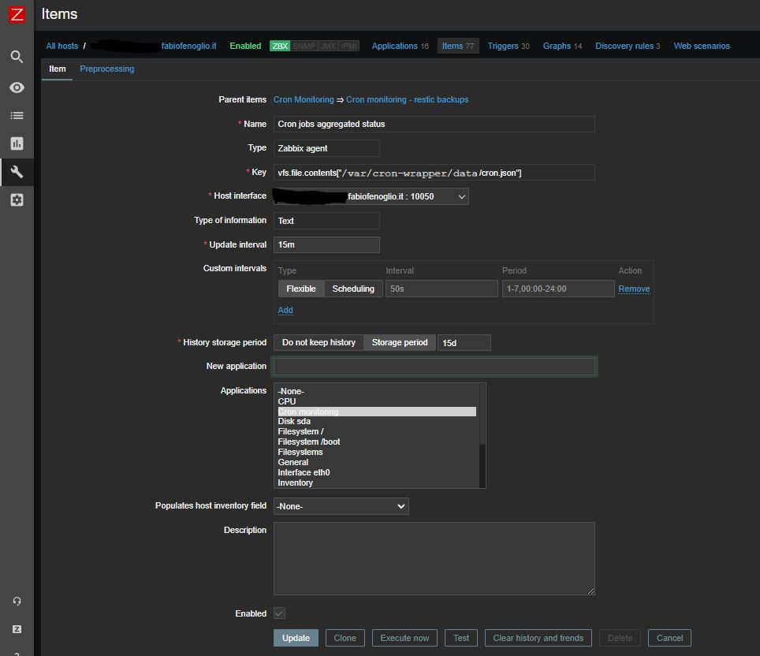

Now your Zabbix instance is configured to efficiently fetch all the raw data it needs to monitor your cronjobs. However, to allow for finer monitoring some dependent items should be created before configuring triggers.

## Setup Zabbix to compute dependent data from the captured data

Now, **for each** cronjob you want to monitor, you should create dependent items extracting granular data.

Let's suppose I wanted to monitor the cronjob I named `restic_backup_mysql`.
I will create the following three dependent items:

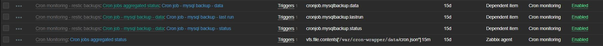

1. the specific cronjob data item
   - Name: whatever, like `Cron job - mysql backup`
   - Type: Dependent item
   - Key: as you'd like, for example `cronjob.mysqlbackup.data`
   - Master item: the first item you created at the previous step fetching the aggregated data. I named it 'Cron jobs aggregated status'
   - Type of information: Text
   - Applications: I usually create a custom "Cron monitoring" dedicated application on the host
   - Preprocessing:
     1. A preprocessing step of type `JSONPath` with parameter: `$.restic_backup_mysql` (or whatever the name of your job is). This will extract the data for the specific job from the aggregated json data.
    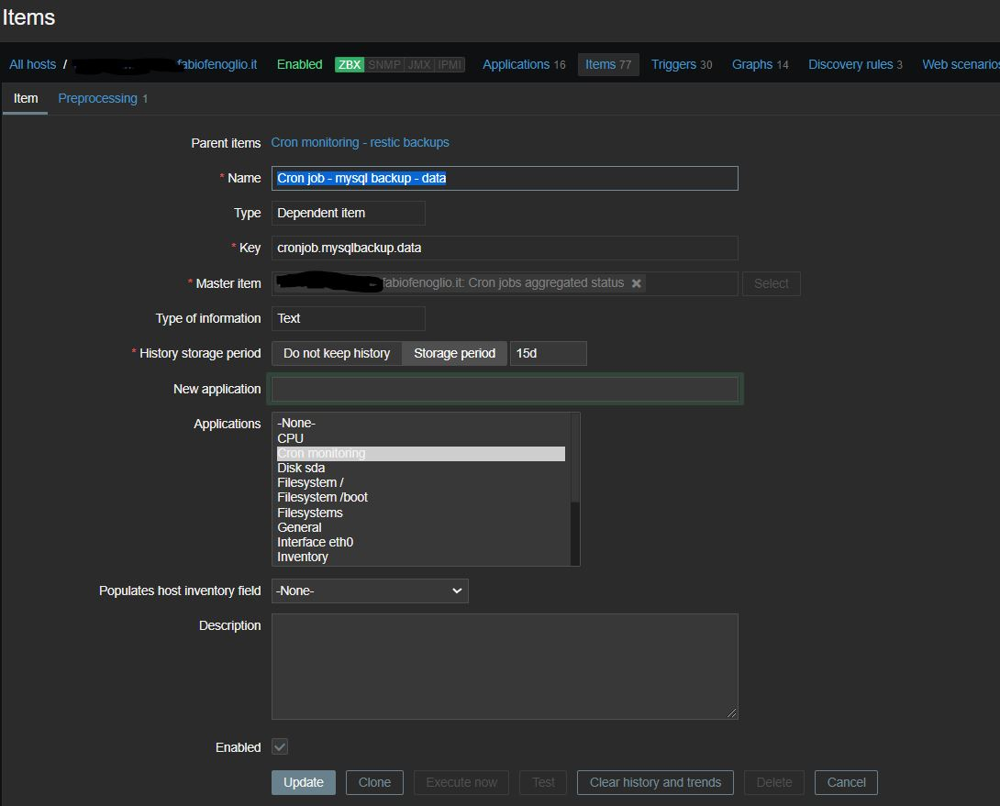
    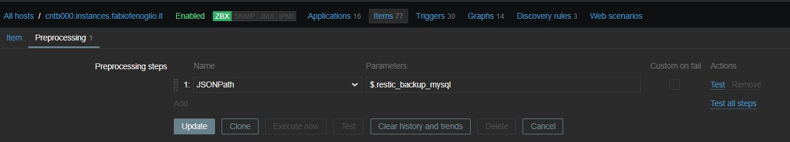
2. the 'status' field for the cronjob data
   - Name: whatever, like `Cron job - mysql backup - status`
   - Type: Dependent item
   - Key: as you'd like, for example `cronjob.mysqlbackup.status`
   - Master item: the item #1 you just created (the specific cronjob data item, **not** the original aggregated data)
   - Type of information: Text
   - Applications: I usually create a custom "Cron monitoring" dedicated application on the host
   - Preprocessing:
     1. A preprocessing step of type `JSONPath` with parameter `$.status`
    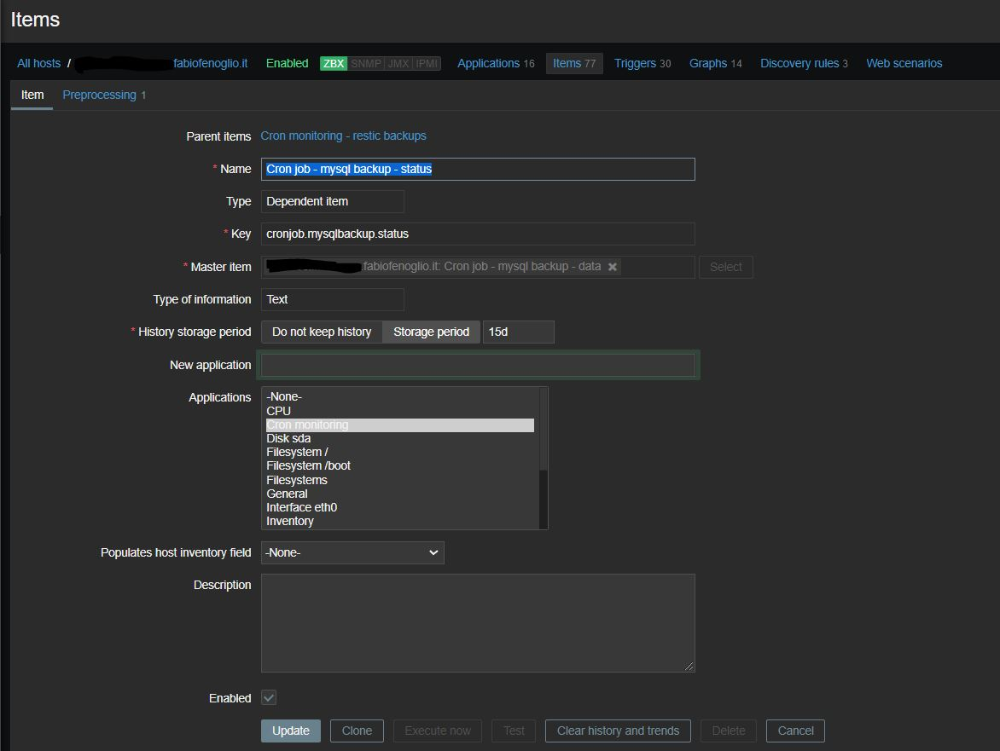
    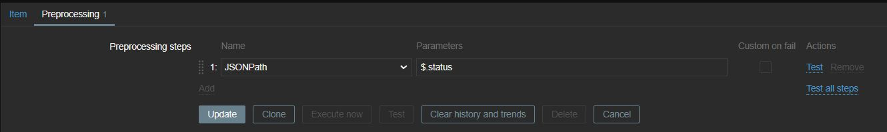
3. the 'last run' field for the cronjob data
   - Name: whatever, like `Cron job - mysql backup - last run`
   - Type: Dependent item
   - Key: as you'd like, for example `cronjob.mysqlbackup.lastrun`
   - Master item: the item #1 you just created (the specific cronjob data item, **not** the original aggregated data)
   - Type of information: Text
   - Applications: I usually create a custom "Cron monitoring" dedicated application on the host
   - Preprocessing:
     1. A preprocessing step of type `Javascript` with the following script: 
     ```
     var data = JSON.parse(value);
     if (!data.startedAt) {
        throw new Error('No StartedAt data');
     }
     var startedAt = new Date(new Date(data.startedAt).getTime() - 3600000);
     var diff = Math.round( ( new Date().getTime() - startedAt.getTime() ) /1000.0 );
     return diff >= 0 ? diff : 0;
     ```
     This script extracts the number of seconds since the last execution of the cronjob.
     **NOTE**: the `- 3600000` in the scripts corrects the timezone difference between the date saved from the wrapper script and the timezone of the Zabbix server. You might need to change this value according to your timezones.
    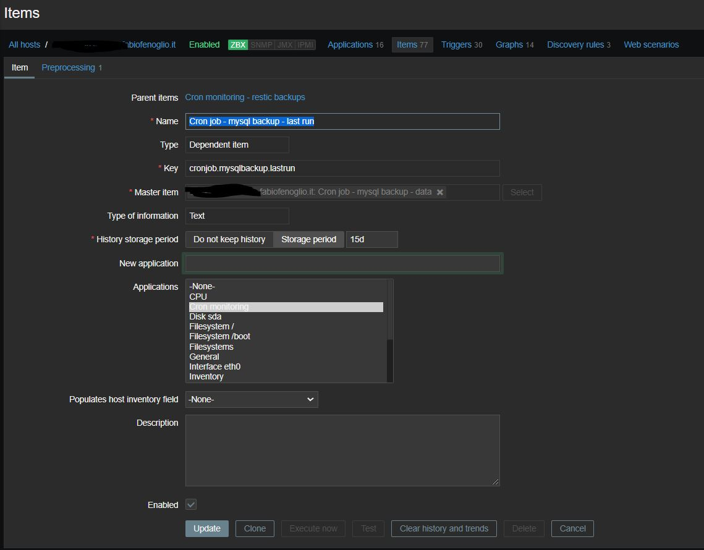
    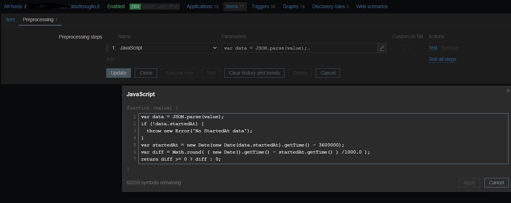

You should have all the data you need now.
If you check the 'latest data' you should see something like this:

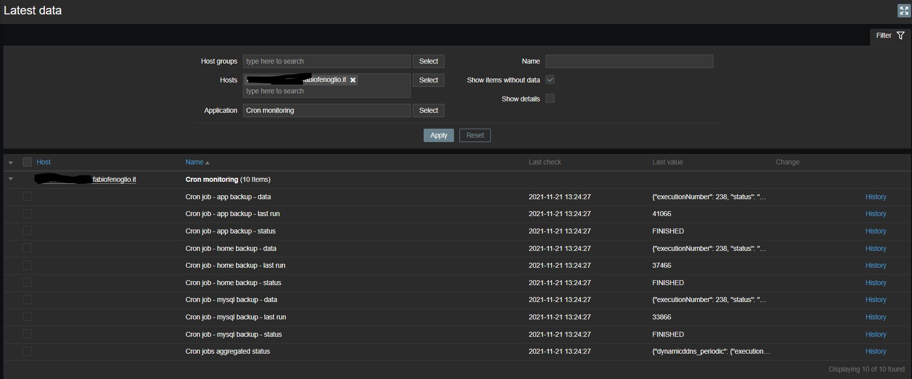

**NOTE**: if some of the 'last run' data appears wrong or is negative you probably have a timezone mismatch. You should correct the offset (where you see `- 3600000` in the sample) according to your timezones difference.

## Setup triggers on Zabbix

The last step consists in setting up the right triggers.
You should at the very minimum setup:

- A trigger to check that the aggregated monitoring data has been fetched correctly and is up to date
- A trigger for each monitored cron job to check that you have its specific data, that it is running on schedule and that its last execution did not fail.

For the first one, configure a trigger with:
- Name: whatever, something like 'Cron monitoring data is not available'
- Expression: `{your.host.com:vfs.file.contents["/var/cron-wrapper/data/cron.json"].nodata(1800)}=1`

This will fire the trigger if no aggregated data has been fetched in the last 1800 seconds. You can set the time amount you prefer.

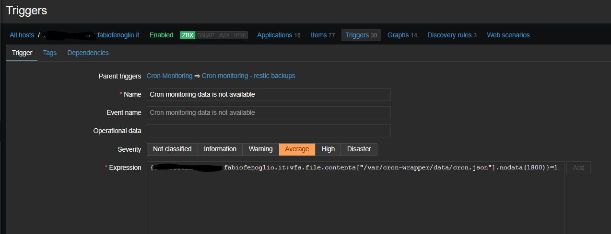

For each monitored cron job you should setup the trigger like this:
- Name: whatever, like 'Cron job failed - mysql backup'
- Expression: 
    ```
    {your.host.com:cronjob.mysqlbackup.data.nodata(3600)}=1 or {your.host.com:cronjob.mysqlbackup.status.last()}="FAILED" or {your.host.com:cronjob.mysqlbackup.lastrun.last()}>87000
    ```

This will fire the trigger:
- if no data for the specific job has been available in the last 3600 seconds
- if the last execution is older than 87000 (a bit more than 24h, you can setup your interval here depending on your job schedule)
- if the last execution failed

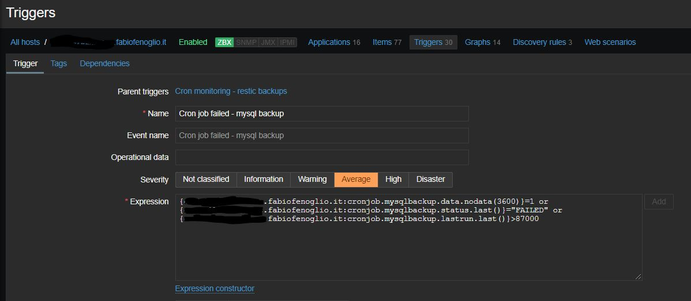

## Congratulations

Congratulations, your cronjobs are now being effectively monitored!

# Syntax reference

## Wrapper script syntax

The scripts accepts invocation with the following syntax:

```
root@cntb000:~# /app/scripts/cron/cron-wrapper.sh -h

usage: cron-wrapper.sh [-h] [--timeout TIMEOUT]
                       [--output-folder OUTPUT_FOLDER]
                       [--output-file OUTPUT_FILE] [--report-stdout]
                       [--report-previous] [--force] [--skip-write]
                       [--skip-read] [--skip-aggregation] [--verbose] [--debug]
                       name command

Process CRON job.

positional arguments:
  name                  the unique name for the job
  command               the command to run

optional arguments:
  -h, --help            show this help message and exit
  --timeout TIMEOUT, -t TIMEOUT
                        timeout in seconds
  --force, -f           force execution if another instance is running
  --verbose, -v         show verbose log
  --output-folder OUTPUT_FOLDER
                        output folder for status file
  --output-file OUTPUT_FILE, -o OUTPUT_FILE
                        output status file
  --report-stdout       report stdout in status file
  --report-previous     report previous info in status file
  --skip-write          do not write to output file
  --skip-read           do not read latest status from output file
  --skip-aggregation    do not write to aggregated output file
  --debug               run in debug mode with additional output
```

## Details of available invocation parameters

| Parameter  | Usage sample | Default value | Notes |
| ------------- | ------------- | ------------- | ------------- |
| --timeout, -t  | -t 3600  | 60 seconds  | sets the timeout (in seconds) for the job execution. |
| --output-folder  | --output-folder /home/my-cron-wrapper-data  | /var/cron-wrapper/data | sets the folder where the json output data files will be created |
| --output-file, -o  | /home/my-cron-wrapper-data/aggregated.json | [output-folder]/cron.json | full path to the aggregated data json output file |
| --report-stdout   | --report-stdout | false | if given, stdout and stderr for each execution will be included in the output json |
| --report-previous  | --report-previous | false | if given, details of the previous-to-the-latest execution will be stored in the output json |
| --force  | --force | false | forces execution of the job even if another instance is currently running |
| --skip-write  | --skip-write | false | runs the command in the wrapper but does not store and write output data to the json files. useful for testing |
| --skip-aggregation  | --skip-aggregation | false | runs the command in the wrapper, writes the output to the job json file but does not write to the aggregated json data file |
| --verbose, -v  | --verbose | false | runs in verbose mode with additional output. When run in verbose mode additional output data is added to the json files (see later). |

## Available data in the output json files

| Key  | Format | Sample value | Notes |
| ------------- | ------------- | ------------- | ------------- |
| executionNumber | positive integer | 238 | incremental counter for the number of executions |
| status | string | FINISHED | one of FINISHED, FAILED, RUNNING |
| startedAt | string in ISO format | 2021-11-21T04:00:02.297280 | timestamp of the start time for the last execution |
| expiresAt | string in ISO format | 2021-11-21T05:00:02.297280 | the timeout timestamp for the last execution |
| returnCode | integer | 0 | the exit code of the latest execution |
| timedOut | boolean | false | is true if the latest execution timed out |
| finishedAt | string in ISO format | 2021-11-21T04:00:40.568388 | timestamp of the end time for the last execution |
| duration | positive float | 38.271108 | duration (in seconds) of the last execution from start to finish |
| success | boolean | true | true if the latest execution completed succesfully, without timing out |
| executionId | UUID | a94413b5-98d2-4de5-8422-9ef1a05320c0 | an unique UUID associated  with the latest execution. Only written if SAVE_EXECUTION_UUID is enabled in the python script (disabled by default) |
| previous | object | { ... } | the second-last execution data. only available when run with --report-previous |
| user | string | root | the name of the user the cron command was run with. Same as output of the whoami command. Only available when run with --debug |
| workingDirectory | string | /var/a-folder | the working directory the cron command was run with. Same as output of the pwd command. Only available when run with --debug |
| stdOut | string | stdout from the command execution | stdout output from the command execution. Only available when run with --report-stdout |
| stdErr | string | stderr from the command execution | stderr output from the command execution. Only available when run with --report-stdout |
| error | string | an error message | error message in case the latest execution failed. Only available when the latest execution failed. |
| errorDetails | string | some additional error details | additional error details in case the latest execution failed. Only available when the latest execution failed. |


# Additional info

### Want to handle timing out of a cronjob?

You can use the --timeout or -t parameter to set a timeout. The job will be canceled after the specified number of seconds.
For instance running

```
./cron-wrapper.sh -t 3 "test-job" "sleep 5 && ls /"
```

will fail and produce an output data similar to this:

```
$ cat /var/cron-wrapper/data/test-job.json  | jq

{
  "executionNumber": 23,
  "status": "FAILED",
  "startedAt": "2021-11-21T14:52:44.721608",
  "expiresAt": "2021-11-21T14:52:47.721608",
  "error": "Command 'sleep 5 && ls /' timed out after 3 seconds",
  "errorDetails": "TimeoutExpired('sleep 5 && ls /', 3)",
  "timedOut": true,
  "finishedAt": "2021-11-21T14:52:47.814169",
  "duration": 3.092561,
  "success": false
}
```


### Want to redirect the stdout of the wrapper script to a file?

Just set the variable STDOUT_OUTPUT_FILE to an absolute path in the script file. This will cause the output to redirect from console to the specified file.